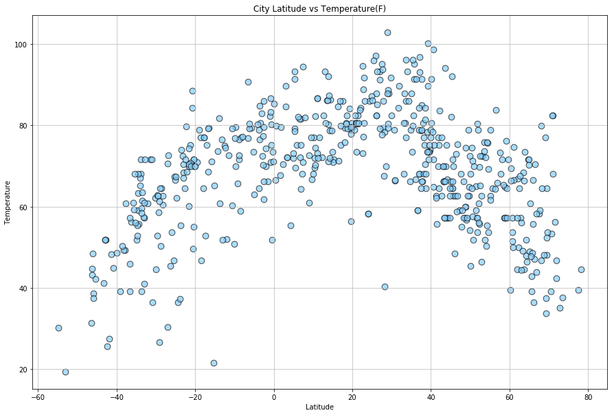
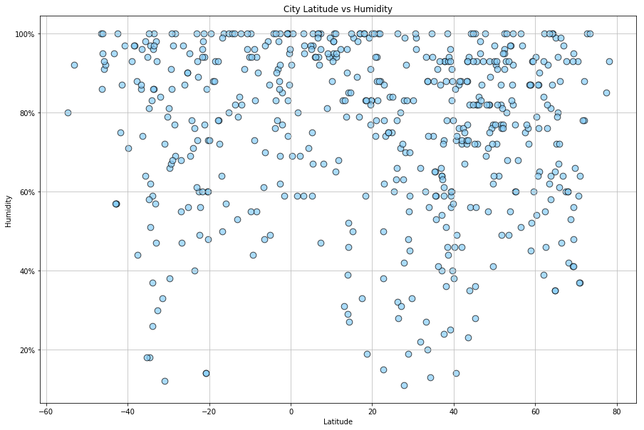
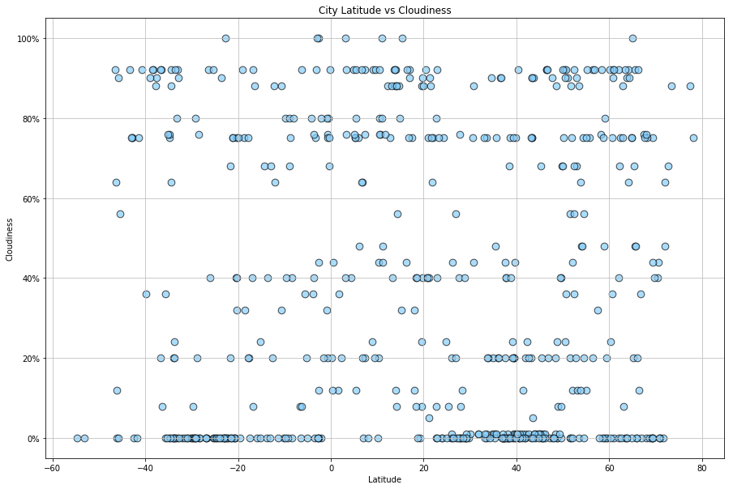
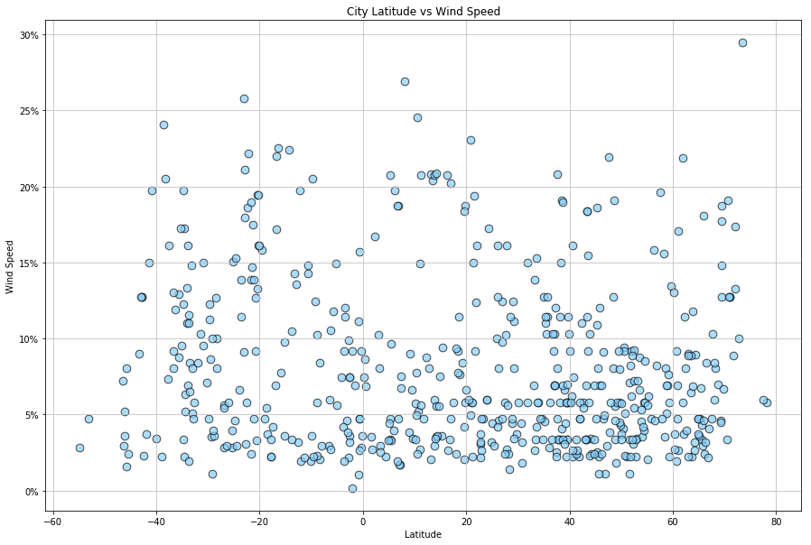

# Calling Open Weather...

Utilizing the Open Weather API on July 18, 2018, data surverying 557 random cities was compiled on humidity%, temperature (F), cloud%, and wind speed (mph). In surveying the data, there (unsurprisingly) appeared to be a correlation between latitude and temperature. When visualized in as scatter plot, the points formed a curve similar to a standard distribution with the Tropic of Cancer (23°26ʹ Latitude) at the center. Temperature tended to decrease the further latitude position the city fell from this point. This makes sense considering that the data was compiled during the Northern Hemisphere summer.

Cloud cover based on Latitude was a striking visualization. Latitude did not appear to have a strong influence on cloudiness, rather it raised questions about how cloud cover it measured. When compared to the visuals of humidity and wind speed, which both are rather nebulous, cloud levels seemed to bucket in particular % levels. The resulting image appeared to be a series of lines with scattered points between them. These "lines" of data populated around 0%, 20%, 40%, 75%, and 90%. Since cloud cover is generally measured in oktas, which is on a scale of 0-8, it follows that visualzations would populate along particular lines.

Though the data was compiled randomly, it was striking to see a preference for cities in the Northern Hemisphere. Latitude values ranged from -60 to 80 with what looked like 2/3 of the data points populating >0. In a way, the data visualized the landmass distibution of Earth itself: ~68% Northern Hemisphere, ~32% Southern Hemisphere. This indicates that we would see similar patterns when surveying Longitude data, as the landmass distribution is roughly the same East vs West.


```python
# Dependencies and Setup
import matplotlib.pyplot as plt
import pandas as pd
import numpy as np
import requests
import time
from pprint import pprint

# Import API key
import api_keys

# Incorporated citipy to determine city based on latitude and longitude
from citipy import citipy
```

## Generate Cities List


```python
# List for holding lat_lngs and cities
lat_lngs = []
cities = []

# Create a set of random lat and lng combinations
lats = np.random.uniform(low=-90.000, high=90.000, size=1500)
lngs = np.random.uniform(low=-180.000, high=180.000, size=1500)
lat_lngs = zip(lats, lngs)

# Identify nearest city for each lat, lng combination
for lat_lng in lat_lngs:
    city = citipy.nearest_city(lat_lng[0], lat_lng[1]).city_name
    
    # If the city is unique, then add it to a our cities list
    if city not in cities:
        cities.append(city)

# Print the city count to confirm sufficient count
len(cities)
```
    620

## Perform API Calls


```python
#create an empty list to store dictionaries in order to build DataFrame
w_list = []

# OpenWeatherMap API Key
api_key = api_keys.api_key

#establish base url
url = "http://api.openweathermap.org/data/2.5/weather?"

#outline parameters
params = {"APPID": api_key,
         "units": "Imperial"}

print("Initializing Data Retrieval")
print("-" * len("Initializing Data Retrieval"))

for index, city in enumerate(cities):
    while True:
        try:
            params["q"] = city
            response = requests.get(url, params=params).json()
            if response['cod'] == '404':
                print('City not found. Moving on.')
                time.sleep(1)
            else:
                #print(f'Retrieving record {index} of {len(cities)} | {city}, id:{test["id"]}')
                print(f'Retrieving record {index + 1} of {len(cities)} | {city}, id:{response["id"]}')
                weather = {'City Name': response['name'],
                           'Cloud':response['clouds']['all'],
                           'Country': response['sys']['country'],
                           'Date': response['dt'],
                           'Humidity': response['main']['humidity'],
                           'Latitude': response['coord']['lat'],
                           'Longitude': response['coord']['lon'],
                           'Maximum Temperature': response['main']['temp_max'], 'Wind Speed': response['wind']['speed']}
                w_list.append(weather)
                time.sleep(1)
        except TimeoutError:
                sleep(10)
                continue
        break
                
            
        
print("-" * len("Data retrieval complete"))
print("Data retrieval complete")

weather_raw = pd.DataFrame(w_list)
weather_raw.head()
    
```

    Initializing Data Retrieval
    ---------------------------
    -----------------------
    Data retrieval complete
    
<div>
<table border="1" class="dataframe">
  <thead>
    <tr style="text-align: right;">
      <th></th>
      <th>City Name</th>
      <th>Cloud</th>
      <th>Country</th>
      <th>Date</th>
      <th>Humidity</th>
      <th>Latitude</th>
      <th>Longitude</th>
      <th>Maximum Temperature</th>
      <th>Wind Speed</th>
    </tr>
  </thead>
  <tbody>
    <tr>
      <th>0</th>
      <td>Khatanga</td>
      <td>48</td>
      <td>RU</td>
      <td>1531977064</td>
      <td>78</td>
      <td>71.98</td>
      <td>102.47</td>
      <td>42.33</td>
      <td>17.38</td>
    </tr>
    <tr>
      <th>1</th>
      <td>Tuktoyaktuk</td>
      <td>75</td>
      <td>CA</td>
      <td>1531972800</td>
      <td>48</td>
      <td>69.44</td>
      <td>-133.03</td>
      <td>64.40</td>
      <td>12.75</td>
    </tr>
    <tr>
      <th>2</th>
      <td>Victoria</td>
      <td>75</td>
      <td>BN</td>
      <td>1531974600</td>
      <td>75</td>
      <td>5.28</td>
      <td>115.24</td>
      <td>91.40</td>
      <td>3.36</td>
    </tr>
    <tr>
      <th>3</th>
      <td>Bodden Town</td>
      <td>0</td>
      <td>KY</td>
      <td>1531976784</td>
      <td>99</td>
      <td>19.28</td>
      <td>-81.25</td>
      <td>84.09</td>
      <td>8.43</td>
    </tr>
    <tr>
      <th>4</th>
      <td>Cermik</td>
      <td>0</td>
      <td>TR</td>
      <td>1531975800</td>
      <td>36</td>
      <td>38.14</td>
      <td>39.45</td>
      <td>77.00</td>
      <td>3.36</td>
    </tr>
  </tbody>
</table>
</div>

```python
#save DataFrame to csv file so the calls do not need to be repeated
weather_raw.to_csv("weather_by_city.csv")
weather_raw.count()
```

    City Name              557
    Cloud                  557
    Country                557
    Date                   557
    Humidity               557
    Latitude               557
    Longitude              557
    Maximum Temperature    557
    Wind Speed             557
    dtype: int64

```python
#build a scatter plot based on the columns Latitude and temperature
plt.figure(figsize = (15, 10))
plt.scatter(weather_raw['Latitude'], weather_raw['Maximum Temperature'], s=75, c="lightskyblue", edgecolors='k', alpha=0.7)
plt.grid(color="0.75", linestyle="-")
plt.title("City Latitude vs Temperature(F)")
plt.xlabel("Latitude")
plt.ylabel("Temperature")

#save the plot
plt.savefig('lat_v_temp.png')
plt.show()
```





```python
#build a scatter plot based on the columns Latitude and humidity
plt.figure(figsize = (15, 10))
plt.scatter(weather_raw['Latitude'], weather_raw['Humidity'], s=75, c="lightskyblue", edgecolors='k', alpha=0.7)
plt.grid(color="0.75", linestyle="-")
plt.title("City Latitude vs Humidity")
plt.xlabel("Latitude")
plt.ylabel("Humidity")
plt.gca().set_yticklabels(['{:.0f}%'.format(x) for x in plt.gca().get_yticks()]) 

#save the plot
plt.savefig('lat_v_hum.png')
plt.show()
```





```python
#build a scatter plot based on the columns Latitude and cloudiness
plt.figure(figsize = (15, 10))
plt.scatter(weather_raw['Latitude'], weather_raw['Cloud'], s=75, c="lightskyblue", edgecolors='k', alpha=0.7)
plt.grid(color="0.75", linestyle="-")
plt.title("City Latitude vs Cloudiness")
plt.xlabel("Latitude")
plt.ylabel("Cloudiness")
plt.gca().set_yticklabels(['{:.0f}%'.format(x) for x in plt.gca().get_yticks()])

#save the plot
plt.savefig('lat_v_cloud.png')
plt.show()
```





```python
#build a scatter plot based on the columns Latitude and wind speed
plt.figure(figsize = (15, 10))
plt.scatter(weather_raw['Latitude'], weather_raw['Wind Speed'], s=75, c="lightskyblue", edgecolors='k', alpha=0.7)
plt.grid(color="0.75", linestyle="-")
plt.title("City Latitude vs Wind Speed")
plt.xlabel("Latitude")
plt.ylabel("Wind Speed")
plt.gca().set_yticklabels(['{:.0f}%'.format(x) for x in plt.gca().get_yticks()])

#save the plot
plt.savefig('lat_v_wind.png')
plt.show()
```



